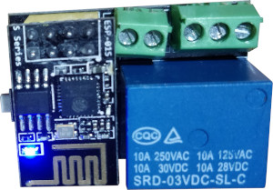

# MQTT client for LC-Technology relay boards.
 

This board doesn't hav a chip but it uses pin 0 to swithc the relay on and off.  
Application uses micropython together with mqtt library so it can be easily controlled via MQTT.
